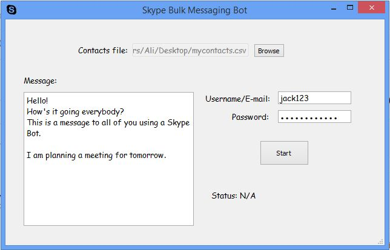

# Skype-BulkMessaging-Bot
A crossplatform PyQt5 Desktop Application which sends a single message to multiple contacts using Skype API.


# How to use?
Install dependencies for first time only:
```
git clone https://github.com/ali-sajjad-rizavi/Skype-BulkMessaging-Bot.git
cd Skype-BulkMessaging-Bot
python -m pip install requirements.txt
```
Now, it is ready to be used. Open the `skypebot.pyw` directly, or from command-line:
```
python skypebot.pyw
```
## Structure of contacts CSV file
You must choose a contacts `.csv` file. This file should have skype contact IDs line by line.
An example of `contacts.csv` contents:
```
live:.cid.7f805f310a6fdcfb
live:.cid.9f805f310a6fdcfb
live:jack123
live:.cid.7f805f310a7fdcfb
```